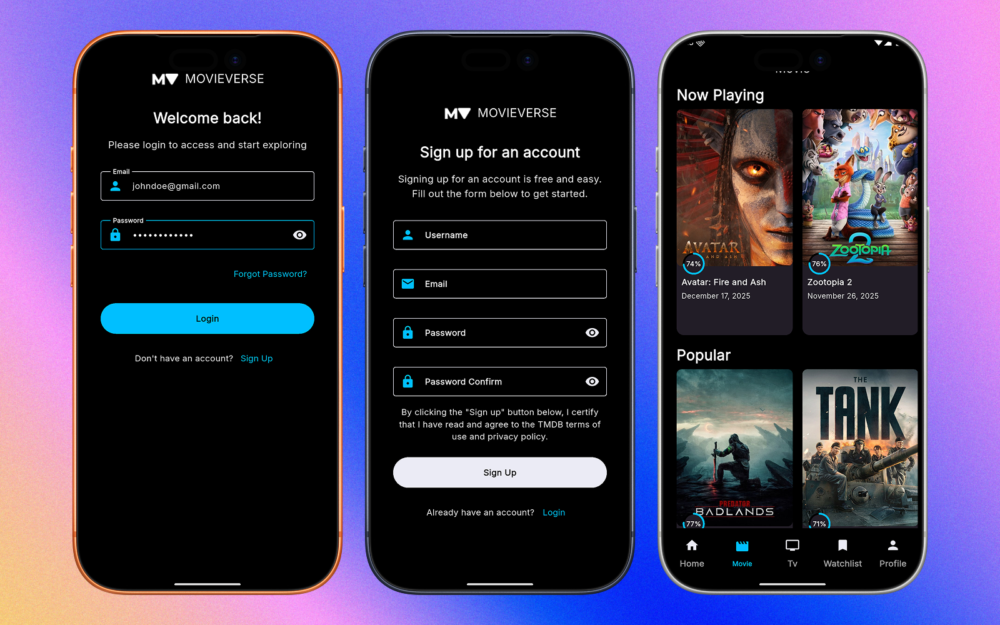

# Movieverse

A cross‑platform Flutter application to browse movies and TV shows (powered by The Movie Database), manage a personal watchlist, and authenticate users via Firebase.




Quick highlights
- Browse popular, trending, top-rated, now-playing and upcoming movies and TV series.
- View detailed pages and recommendations.
- User authentication with Firebase (register / login / logout).
- Persistent watchlist (Firebase + local storage patterns).
- Clean architecture: presentation / domain / data layers; DI with GetIt; state management with flutter_bloc.

Table of contents
- Features
- Architecture overview
- Requirements
- Setup (quick start)
- Environment variables (.env)
- Firebase configuration
- Code generation
- Running the app
- Running tests
- Useful files & where to look
- Troubleshooting
- Contributing
- License & credits

Features
- Movie & TV discovery (discover/trending/popular/top-rated/upcoming)
- Search for movies and TV series
- Movie/TV detail pages with recommendations
- Watchlist (add/remove & list)
- Authentication and user data via Firebase
- Responsive styling and custom theming

Architecture overview
Movieverse follows a clean architecture style with three main layers:
- presentation — UI, routing, bloc state management (lib/presentation)
  - Router: lib/presentation/router.dart
  - Blocs: lib/presentation/bloc/**
  - UI screens & widgets: lib/presentation/screens & lib/presentation/widgets
- domain — business logic and use cases (lib/domain)
  - Use cases: lib/domain/usecases/**
- data — data sources, models, and repository implementations (lib/data)
  - Remote datasource (TMDB): lib/data/datasources/remoteDataSource/remote_data_source.dart
  - Repository implementation: lib/data/repositories/repository_impl.dart
- Dependency injection / service registration: lib/injection.dart (GetIt)
- Entry point: lib/main.dart

Requirements
- Flutter SDK (see pubspec.yaml: SDK constraint: >=3.9.2)
- Platform toolchains for Android/iOS if building to devices
- A TMDB API key (free account at https://www.themoviedb.org)
- Firebase project & platform config files (google-services.json for Android; GoogleService-Info.plist for iOS) if you want auth & Firestore functionality

Quick start (clone, configure, run)
1. Clone the repository
   ```bash
   git clone https://github.com/fathorrosi-dev/movieverse.git
   cd movieverse
   ```
2. Create a `.env` file at the repository root with your TMDB API key (see details in the Environment section).
3. Install dependencies
   ```bash
   flutter pub get
   ```
4. Generate code (freezed / envied)
   ```bash
   flutter pub run build_runner build --delete-conflicting-outputs
   ```
5. Run the app
   ```bash
   flutter run
   ```
   Or to target a specific device:
   ```bash
   flutter run -d <device-id>
   ```

Environment variables (.env)
This project uses Envied (lib/env/env.dart) for injecting the TMDB API key into the build. Create a `.env` file in the repository root with contents like:

```
TMDB_KEY="YOUR_TMDB_BEARER_OR_V4_KEY"
```

Notes:
- The code expects Env.tmdbApiKey to be available from the generated `lib/env/env.g.dart`.
- After creating/modify .env you must run build_runner to regenerate env.g.dart:
  ```bash
  flutter pub run build_runner build --delete-conflicting-outputs
  ```

Firebase configuration
The app calls `Firebase.initializeApp()` in lib/main.dart. To enable full Firebase functionality:
- Create a Firebase project (https://console.firebase.google.com/)
- Add Android/iOS apps and download the appropriate files:
  - Android: copy `google-services.json` to `android/app/`
  - iOS: copy `GoogleService-Info.plist` to `ios/Runner/`
- For Android, ensure Gradle config is present (this repo already contains Android Firebase gradle files).
- For tests or local development, this repo includes test helpers and mock packages (fake_cloud_firestore, firebase_auth_mocks). See tests if you need to mock services.

Code generation
This project uses code generation for Freezed and Envied. Regenerate generated code after changes:
```bash
flutter pub run build_runner build --delete-conflicting-outputs
```
If you prefer continuous generation while developing:
```bash
flutter pub run build_runner watch
```

Running tests
Run all unit/widget tests:
```bash
flutter test
```
Note:
- Some tests may expect Firebase mocks or additional setup. If a test relies on Firebase, it usually uses firebase mocks or fake_cloud_firestore as a dependency.

How to run a production build
- Android (release APK):
  ```bash
  flutter build apk --release
  ```
- iOS:
  ```bash
  flutter build ios --release
  ```
- Desktop/web: use the corresponding `flutter build` commands.

Notable implementation details & where to look
- Entry point and app init: lib/main.dart
  - Keeps splash screen via flutter_native_splash until initialization is complete
  - Initializes Firebase: await Firebase.initializeApp();
  - Registers top-level singletons and dependency injection (di.init())
- Dependency injection: lib/injection.dart (GetIt)
  - All blocs, usecases, repositories, and external clients (http.Client) are registered here
- TMDB networking: lib/data/datasources/remoteDataSource/remote_data_source.dart
  - Base URL used: "http://api.themoviedb.org/3" (consider switching to HTTPS if necessary)
  - Authorization header: 'Authorization': 'Bearer ${Env.tmdbApiKey}'
- HTTP wrapper: lib/data/services/http_client.dart
  - Provides get/post and response decoding helpers
- Repository pattern: lib/data/repositories/repository_impl.dart
  - Converts model results to domain entities and returns Either<NetworkExceptions, T>
- Constants: lib/utils/constant.dart (e.g., baseImgUrl for images)

Troubleshooting & tips
- Missing generated files error (env.g.dart, *.freezed.dart, etc.): run build_runner:
  ```bash
  flutter pub run build_runner build --delete-conflicting-outputs
  ```
- TMDB API access denied: ensure your TMDB key is correct and you use the proper token type. The header expects a bearer token.
- HTTP vs HTTPS: remote_data_source currently uses "http://api.themoviedb.org/3". For production, change to "https://api.themoviedb.org/3".
  - File location: lib/data/datasources/remoteDataSource/remote_data_source.dart
- Firebase issues: ensure google-service files are added and platform builds are configured. Check the Firebase console and SHA-1 (Android) if authentication problems occur.
- Linting/static analysis: the project includes flutter_lints and analysis_options.yaml — run:
  ```bash
  flutter analyze
  ```

Contributing
- Please open issues and PRs against the main branch.
- Follow existing code structure: presentation/domain/data.
- Run tests and code generation locally before opening PRs.
- The project uses flutter_lints; please respect style rules.

Developer commands summary
- Install deps: flutter pub get
- Generate code: flutter pub run build_runner build --delete-conflicting-outputs
- Run app: flutter run
- Run tests: flutter test
- Analyze: flutter analyze

Useful resources
- Flutter docs: https://docs.flutter.dev/
- The Movie Database API: https://developers.themoviedb.org/
- Envied: https://pub.dev/packages/envied
- Freezed: https://pub.dev/packages/freezed

Files to check when debugging or extending
- lib/main.dart — app bootstrap
- lib/injection.dart — DI & service registration
- lib/presentation/router.dart — routes & navigation
- lib/data/datasources/remoteDataSource/remote_data_source.dart — TMDB API client
- lib/domain/usecases — business use cases
- lib/data/repositories/repository_impl.dart — concrete repository logic
- lib/presentation/styles/app_theme.dart — theme and typography
- .env (create at repo root) — TMDB_API key

License & credits
- No LICENSE file is included in this repository. Add an appropriate license file if you plan to make this project open source publicly.
- TMDB is used under its API terms; ensure compliance with their terms of service when distributing the app.

Thanks for checking out Movieverse — happy hacking! If you need help with a specific setup step (Firebase config, token issues, codegen errors), include the error message and I'll help diagnose.